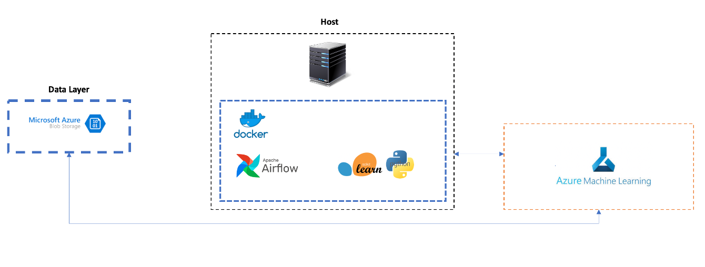

# Azure ML Airflow Project

from az_ml_airflow.libs.data.data_processing import get_data

The project is designed to integrate machine learning and cloud computing. Below we can find a high-level view of the
tools/processes integrated in this project.



We'll be using a docker application with ml tasks orchestrated by Apache Airflow. All processes will be executed using
Azure Machine Learning Resources. 

The objective of this project is to give a basic example on how to integrate such tools.

## Docker 

1. Create Image based on Dockerfile, launching airflow

````docker build --rm --build-arg AIRFLOW_DEPS="gcp,statsd,sentry" --build-arg PYTHON_DEPS="pyspark==2.4.5" --build-arg AIRFLOW_VERSION=1.10.10 -t az_ml_airflow .````

2. Run Container with created image

````docker run -d -p 8080:8080 az_ml_airflow webserver````

3. Access running Container
````docker exec -it <container_id> /bin/bash````